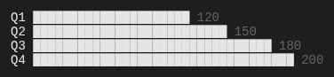
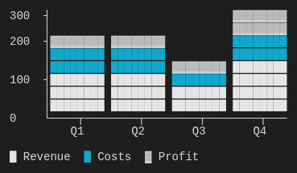
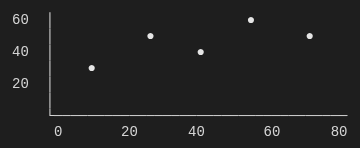
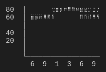
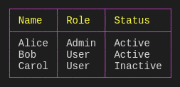
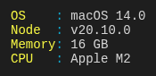
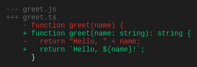
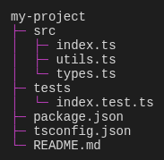
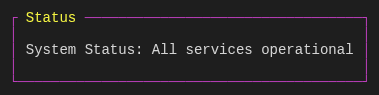

# TUI Components

Terminal UI components for CLI applications and AI assistants. Render rich, interactive visualizations in any terminal environment.

## Component Gallery

### Charts

Create data visualizations with multiple chart types: bar, line, scatter, pie, donut, and heatmap.

| Bar Chart                                         | Stacked Vertical                                        | Pie Chart                              |
| ------------------------------------------------- | ------------------------------------------------------- | -------------------------------------- |
|  |  |  |

| Scatter Plot                                   | Line Chart                               | Heatmap                                        |
| ---------------------------------------------- | ---------------------------------------- | ---------------------------------------------- |
|  |  |  |

### Data Display

| Table                                      | Key-Value                                              | Diff                                         |
| ------------------------------------------ | ------------------------------------------------------ | -------------------------------------------- |
|  |  |  |

### Structure & Navigation

| Tree                                                 | List                                      | Graph (DAG)                                    |
| ---------------------------------------------------- | ----------------------------------------- | ---------------------------------------------- |
|  |  |  |

### Status & Progress

| Progress Bar                                       | Gauge                                           | Sparkline                                               |
| -------------------------------------------------- | ----------------------------------------------- | ------------------------------------------------------- |
|  |  |  |

### Layout

| Box with Title                              | Rounded Box                                  |
| ------------------------------------------- | -------------------------------------------- |
|  |  |

## Features

- **14 component types**: chart, table, tree, list, progress, gauge, sparkline, diff, keyvalue, graph, box, callout, vertical-layout, horizontal-layout
- **Dual rendering modes**: ANSI (colored terminal) and Markdown (for AI assistants)
- **TypeScript-first**: Full type safety with Zod schema validation
- **Minimal runtime dependencies**: Designed to stay lightweight and fast
- **Composable**: Nest components within boxes and layouts

## Installation

```bash
# Install individual packages
pnpm add @tuicomponents/chart
pnpm add @tuicomponents/table

# Or install the meta-package with all components
pnpm add tui-components
```

## Quick Start

```typescript
import { createChart } from "@tuicomponents/chart";
import { createRenderContext } from "@tuicomponents/core";

const chart = createChart();
const context = createRenderContext({ renderMode: "ansi" });

const result = chart.render(
  {
    type: "bar",
    series: [
      {
        name: "Sales",
        data: [
          { x: "Q1", y: 120 },
          { x: "Q2", y: 150 },
          { x: "Q3", y: 180 },
          { x: "Q4", y: 200 },
        ],
      },
    ],
    showValues: true,
  },
  context
);

console.log(result.output);
```

## Render Modes

Components support two rendering modes via the render context:

### ANSI Mode

Rich terminal output with colors and Unicode characters. Perfect for CLI applications.

```typescript
const context = createRenderContext({ renderMode: "ansi" });
```

### Markdown Mode

Plain text output with backtick formatting. Designed for AI assistants like Claude, ChatGPT, and GitHub Copilot that render markdown.

```typescript
const context = createRenderContext({ renderMode: "markdown" });
```

## Packages

| Package                                        | Description                                    |
| ---------------------------------------------- | ---------------------------------------------- |
| [@tuicomponents/chart](packages/chart)         | Bar, line, scatter, pie, donut, heatmap charts |
| [@tuicomponents/table](packages/table)         | Tabular data with customizable borders         |
| [@tuicomponents/tree](packages/tree)           | Hierarchical data visualization                |
| [@tuicomponents/list](packages/list)           | Bulleted and numbered lists with nesting       |
| [@tuicomponents/progress](packages/progress)   | Horizontal progress bars                       |
| [@tuicomponents/gauge](packages/gauge)         | Meters with threshold zones                    |
| [@tuicomponents/sparkline](packages/sparkline) | Compact inline data visualization              |
| [@tuicomponents/diff](packages/diff)           | Unified diff with additions/deletions          |
| [@tuicomponents/keyvalue](packages/keyvalue)   | Aligned key-value pairs                        |
| [@tuicomponents/graph](packages/graph)         | DAG visualization (git log style)              |
| [@tuicomponents/box](packages/box)             | Bordered containers with titles                |
| [@tuicomponents/callout](packages/callout)     | Semantic alert boxes (tip, warning, error)     |
| [@tuicomponents/layout](packages/layout)       | Vertical and horizontal layout composition     |
| [@tuicomponents/core](packages/core)           | Shared utilities and registry                  |
| [@tuicomponents/cli](packages/cli)             | Command-line tool for rendering                |

## CLI Usage

Render components directly from the command line:

```bash
# Using npx
npx tui-components render chart --json '{"type":"bar","series":[{"name":"Data","data":[{"x":"A","y":10},{"x":"B","y":20}]}]}'

# List available components
npx tui-components list

# View component schema
npx tui-components schema chart
```

If installed globally or in a project:

```bash
tui-components render chart --json '{"type":"bar","series":[{"name":"Data","data":[{"x":"A","y":10},{"x":"B","y":20}]}]}'
```

## License

UNLICENSED
