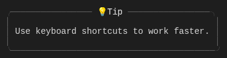
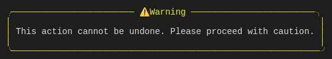
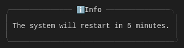

# @tuicomponents/callout

Semantic callout/alert box for tips, warnings, errors, and more.



## Installation

```bash
pnpm add @tuicomponents/callout
```

## Quick Start

```typescript
import { createCallout } from "@tuicomponents/callout";
import { createRenderContext } from "@tuicomponents/core";

const component = createCallout();
const context = createRenderContext();

const result = component.render(
  {
    type: "tip",
    message: "Use keyboard shortcuts to work faster.",
  },
  context
);
console.log(result.output);
```

## Examples

### tip

A helpful tip callout


<details>
<summary>Input</summary>

```json
{
  "type": "tip",
  "message": "Use keyboard shortcuts to work faster."
}
```

</details>

### warning

A warning message



<details>
<summary>Input</summary>

```json
{
  "type": "warning",
  "message": "This action cannot be undone. Please proceed with caution."
}
```

</details>

### error

An error message


<details>
<summary>Input</summary>

```json
{
  "type": "error",
  "message": "Failed to connect to the database. Please check your credentials."
}
```

</details>

### success

A success message


<details>
<summary>Input</summary>

```json
{
  "type": "success",
  "message": "Your changes have been saved successfully!"
}
```

</details>

### info

General information



<details>
<summary>Input</summary>

```json
{
  "type": "info",
  "message": "The system will restart in 5 minutes."
}
```

</details>

## Configuration Options

| Property      | Type                                                             | Required | Default | Description                     |
| ------------- | ---------------------------------------------------------------- | -------- | ------- | ------------------------------- |
| `type`        | `"tip" \| "note" \| "info" \| "warning" \| "error" \| "success"` | ✓        | -       | Semantic type of the callout    |
| `message`     | `string`                                                         | ✓        | -       | The callout message content     |
| `title`       | `string`                                                         |          | -       | Custom title (defaults by type) |
| `icon`        | `string`                                                         |          | -       | Custom icon (defaults by type)  |
| `width`       | `number`                                                         |          | -       | Fixed width in columns          |
| `borderStyle` | `"single" \| "double" \| "round" \| "bold" \| "none"`            |          | "round" | Border style                    |

## Callout Types

| Type      | Default Icon | Default Title | Use Case               |
| --------- | ------------ | ------------- | ---------------------- |
| `tip`     | 💡           | Tip           | Helpful suggestions    |
| `note`    | 📝           | Note          | Additional information |
| `info`    | ℹ️           | Info          | General information    |
| `warning` | ⚠️           | Warning       | Cautionary messages    |
| `error`   | ❌           | Error         | Error notifications    |
| `success` | ✅           | Success       | Success confirmations  |

## Render Modes

The component supports two render modes:

- **ANSI**: Rich terminal output with colors and Unicode characters
- **Markdown**: Plain text suitable for AI assistants and documentation

```typescript
import { createRenderContext } from "@tuicomponents/core";

// ANSI mode (default)
const ansiContext = createRenderContext({ renderMode: "ansi" });

// Markdown mode
const mdContext = createRenderContext({ renderMode: "markdown" });
```

## API

For detailed API documentation, see the [API docs](../../docs/callout.md).

## License

UNLICENSED
