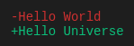
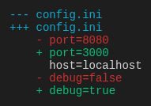

# @tuicomponents/diff

Renders unified diff format with additions and deletions

## Installation

```bash
pnpm add @tuicomponents/diff
```

## Quick Start

```typescript
import { createDiff } from "@tuicomponents/diff";
import { createRenderContext } from "@tuicomponents/core";

const component = createDiff();
const context = createRenderContext();

const result = component.render(
  {
    hunks: [
      {
        lines: [
          {
            type: "deletion",
            content: "Hello World",
          },
          {
            type: "addition",
            content: "Hello Universe",
          },
        ],
      },
    ],
  },
  context
);
console.log(result.output);
```

## Examples

### basic

Simple text diff



<details>
<summary>Input</summary>

```json
{
  "hunks": [
    {
      "lines": [
        {
          "type": "deletion",
          "content": "Hello World"
        },
        {
          "type": "addition",
          "content": "Hello Universe"
        }
      ]
    }
  ]
}
```

</details>

### config-change

Configuration file diff



<details>
<summary>Input</summary>

```json
{
  "oldFile": "config.ini",
  "newFile": "config.ini",
  "showLineNumbers": true,
  "hunks": [
    {
      "lines": [
        {
          "type": "deletion",
          "content": "port=8080"
        },
        {
          "type": "addition",
          "content": "port=3000"
        },
        {
          "type": "context",
          "content": "host=localhost"
        },
        {
          "type": "deletion",
          "content": "debug=false"
        },
        {
          "type": "addition",
          "content": "debug=true"
        }
      ]
    }
  ]
}
```

</details>

### code-diff

Code change diff


<details>
<summary>Input</summary>

```json
{
  "oldFile": "greet.js",
  "newFile": "greet.ts",
  "showLineNumbers": true,
  "hunks": [
    {
      "lines": [
        {
          "type": "deletion",
          "content": "function greet(name) {"
        },
        {
          "type": "addition",
          "content": "function greet(name: string): string {"
        },
        {
          "type": "deletion",
          "content": "  return \"Hello, \" + name;"
        },
        {
          "type": "addition",
          "content": "  return `Hello, ${name}!`;"
        },
        {
          "type": "context",
          "content": "}"
        }
      ]
    }
  ]
}
```

</details>

## Configuration Options

| Property          | Type       | Required | Default | Description |
| ----------------- | ---------- | -------- | ------- | ----------- | --- | --- |
| `hunks`           | `object[]` | ✓        | -       | -           |
| `oldFile`         | `string`   |          | -       | -           |
| `newFile`         | `string`   |          | -       | -           |
| `showLineNumbers` | `boolean`  |          | -       | -           |
| `markerStyle`     | `"symbol"  | "word"   | "none"` |             | -   | -   |
| `showHunkHeaders` | `boolean`  |          | -       | -           |
| `contextLines`    | `number`   |          | -       | -           |

## Render Modes

The component supports two render modes:

- **ANSI**: Rich terminal output with colors and Unicode characters
- **Markdown**: Plain text suitable for AI assistants and documentation

You can specify the render mode when creating the context:

```typescript
import { createRenderContext } from "@tuicomponents/core";

// ANSI mode (default)
const ansiContext = createRenderContext({ renderMode: "ansi" });

// Markdown mode
const mdContext = createRenderContext({ renderMode: "markdown" });
```

## API

For detailed API documentation, see the [API docs](../../docs/diff.md).

## License

UNLICENSED
