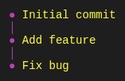

# @tuicomponents/graph

Renders DAG visualizations similar to git log --graph

## Installation

```bash
pnpm add @tuicomponents/graph
```

## Quick Start

```typescript
import { createGraph } from '@tuicomponents/graph';
import { createRenderContext } from '@tuicomponents/core';

const component = createGraph();
const context = createRenderContext();

const result = component.render({
  "nodes": [
    {
      "id": "a",
      "label": "Initial commit",
      "parents": []
    },
    {
      "id": "b",
      "label": "Add feature",
      "parents": [
        "a"
      ]
    },
    {
      "id": "c",
      "label": "Fix bug",
      "parents": [
        "b"
      ]
    }
  ]
}, context);
console.log(result.output);
```

## Examples

### basic

Simple commit graph



<details>
<summary>Input</summary>

```json
{
  "nodes": [
    {
      "id": "a",
      "label": "Initial commit",
      "parents": []
    },
    {
      "id": "b",
      "label": "Add feature",
      "parents": [
        "a"
      ]
    },
    {
      "id": "c",
      "label": "Fix bug",
      "parents": [
        "b"
      ]
    }
  ]
}
```

</details>

### branching

Git graph with branches


<details>
<summary>Input</summary>

```json
{
  "nodes": [
    {
      "id": "1",
      "label": "Initial commit",
      "parents": []
    },
    {
      "id": "2",
      "label": "Add login",
      "parents": [
        "1"
      ]
    },
    {
      "id": "3",
      "label": "Feature branch",
      "parents": [
        "2"
      ]
    },
    {
      "id": "4",
      "label": "Main update",
      "parents": [
        "2"
      ]
    },
    {
      "id": "5",
      "label": "Merge",
      "parents": [
        "3",
        "4"
      ]
    }
  ]
}
```

</details>

## Configuration Options

| Property | Type | Required | Default | Description |
|----------|------|----------|---------|-------------|
| `nodes` | `object[]` | ✓ | - | - |
| `style` | `"ascii" | "unicode"` |  | - | - |
| `labelWidth` | `number` |  | - | - |
| `showRefs` | `boolean` |  | - | - |
| `labelGap` | `number` |  | - | - |
| `nodeChar` | `string` |  | - | - |

## Render Modes

The component supports two render modes:

- **ANSI**: Rich terminal output with colors and Unicode characters
- **Markdown**: Plain text suitable for AI assistants and documentation

You can specify the render mode when creating the context:

```typescript
import { createRenderContext } from '@tuicomponents/core';

// ANSI mode (default)
const ansiContext = createRenderContext({ renderMode: 'ansi' });

// Markdown mode
const mdContext = createRenderContext({ renderMode: 'markdown' });
```

## API

For detailed API documentation, see the [API docs](../../docs/graph.md).

## License

UNLICENSED
