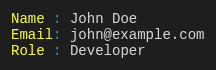

# @tuicomponents/keyvalue

Renders key-value pairs in an aligned format

## Installation

```bash
pnpm add @tuicomponents/keyvalue
```

## Quick Start

```typescript
import { createKeyvalue } from "@tuicomponents/keyvalue";
import { createRenderContext } from "@tuicomponents/core";

const component = createKeyvalue();
const context = createRenderContext();

const result = component.render(
  {
    pairs: [
      {
        key: "Name",
        value: "John Doe",
      },
      {
        key: "Email",
        value: "john@example.com",
      },
      {
        key: "Role",
        value: "Developer",
      },
    ],
  },
  context
);
console.log(result.output);
```

## Examples

### basic

Simple key-value pairs



<details>
<summary>Input</summary>

```json
{
  "pairs": [
    {
      "key": "Name",
      "value": "John Doe"
    },
    {
      "key": "Email",
      "value": "john@example.com"
    },
    {
      "key": "Role",
      "value": "Developer"
    }
  ]
}
```

</details>

### system-info

System information


<details>
<summary>Input</summary>

```json
{
  "pairs": [
    {
      "key": "OS",
      "value": "macOS 14.0"
    },
    {
      "key": "Node",
      "value": "v20.10.0"
    },
    {
      "key": "Memory",
      "value": "16 GB"
    },
    {
      "key": "CPU",
      "value": "Apple M2"
    }
  ]
}
```

</details>

## Configuration Options

| Property      | Type       | Required | Default | Description |
| ------------- | ---------- | -------- | ------- | ----------- | ------- | --- | --- | --- |
| `pairs`       | `object[]` | ✓        | -       | -           |
| `separator`   | `"colon"   | "equals" | "arrow" | "dots"      | "none"` |     | -   | -   |
| `alignKeys`   | `boolean`  |          | -       | -           |
| `minKeyWidth` | `number`   |          | -       | -           |
| `gap`         | `number`   |          | -       | -           |

## Render Modes

The component supports three render modes:

- **ANSI**: Rich terminal output with colors and Unicode characters
- **Markdown**: Plain text suitable for AI assistants and documentation
- **Grayscale**: ANSI output without colors (for terminals that don't support color)

You can specify the render mode when creating the context:

```typescript
import { createRenderContext } from "@tuicomponents/core";

// ANSI mode (default)
const ansiContext = createRenderContext({ renderMode: "ansi" });

// Markdown mode
const mdContext = createRenderContext({ renderMode: "markdown" });

// Grayscale mode
const grayscaleContext = createRenderContext({ renderMode: "grayscale" });
```

## API

For detailed API documentation, see the [API docs](../../docs/keyvalue.md).

## License

UNLICENSED
