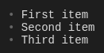
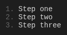
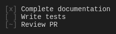

# @tuicomponents/list

Renders lists with support for bullets, numbers, tasks, and definitions.


## Installation

```bash
pnpm add @tuicomponents/list
```

## Quick Start

```typescript
import { createList } from "@tuicomponents/list";
import { createRenderContext } from "@tuicomponents/core";

const component = createList();
const context = createRenderContext();

const result = component.render(
  {
    items: [
      {
        text: "First item",
      },
      {
        text: "Second item",
      },
      {
        text: "Third item",
      },
    ],
    style: "bullet",
  },
  context
);
console.log(result.output);
```

## Examples

### bullet

Bulleted list



<details>
<summary>Input</summary>

```json
{
  "items": [
    {
      "text": "First item"
    },
    {
      "text": "Second item"
    },
    {
      "text": "Third item"
    }
  ],
  "style": "bullet"
}
```

</details>

### numbered

Numbered list



<details>
<summary>Input</summary>

```json
{
  "items": [
    {
      "text": "Step one"
    },
    {
      "text": "Step two"
    },
    {
      "text": "Step three"
    }
  ],
  "style": "numbered"
}
```

</details>

### nested

Nested list with sub-items


<details>
<summary>Input</summary>

```json
{
  "items": [
    {
      "text": "Project setup",
      "items": [
        {
          "text": "Install dependencies"
        },
        {
          "text": "Configure environment"
        }
      ]
    },
    {
      "text": "Development",
      "items": [
        {
          "text": "Write code"
        },
        {
          "text": "Run tests"
        }
      ]
    }
  ],
  "style": "bullet"
}
```

</details>

### task

Task list with checkboxes



<details>
<summary>Input</summary>

```json
{
  "items": [
    { "text": "Complete documentation", "checked": true },
    { "text": "Write tests", "checked": false },
    { "text": "Review PR", "checked": "partial" }
  ],
  "style": "task"
}
```

</details>

### definition

Definition list with terms


<details>
<summary>Input</summary>

```json
{
  "items": [
    { "term": "API", "definition": "Application Programming Interface" },
    { "term": "CLI", "definition": "Command Line Interface" },
    { "term": "TUI", "definition": "Terminal User Interface" }
  ],
  "style": "definition"
}
```

</details>

## Configuration Options

| Property    | Type       | Required | Default    | Description                           |
| ----------- | ---------- | -------- | ---------- | ------------------------------------- |
| `items`     | `object[]` | ✓        | -          | Array of list items                   |
| `style`     | `string`   |          | `"bullet"` | List style (see below)                |
| `indent`    | `number`   |          | `2`        | Indentation for nested items          |
| `start`     | `number`   |          | `1`        | Starting number for numbered styles   |
| `termWidth` | `number`   |          | auto       | Fixed term width for definition lists |

### List Styles

| Style        | Description                    |
| ------------ | ------------------------------ |
| `bullet`     | Bullet points (•)              |
| `dash`       | Dash markers (-)               |
| `arrow`      | Arrow markers (→)              |
| `star`       | Star markers (★)               |
| `numbered`   | Numbered list (1. 2. 3.)       |
| `lettered`   | Lettered list (a. b. c.)       |
| `roman`      | Roman numerals (i. ii. iii.)   |
| `task`       | Task list with checkboxes      |
| `definition` | Definition list (term → value) |
| `none`       | No markers                     |

### Item Types

**Standard Item:**
```typescript
{ text: "Item text", items?: [...] }  // items for nesting
```

**Task Item (for task style):**
```typescript
{ text: "Task text", checked: true | false | "partial" }
```

**Definition Item (for definition style):**
```typescript
{ term: "Term", definition: "Definition text" }
```

## Render Modes

The component supports two render modes:

- **ANSI**: Rich terminal output with colors and Unicode characters
- **Markdown**: Plain text suitable for AI assistants and documentation

You can specify the render mode when creating the context:

```typescript
import { createRenderContext } from "@tuicomponents/core";

// ANSI mode (default)
const ansiContext = createRenderContext({ renderMode: "ansi" });

// Markdown mode
const mdContext = createRenderContext({ renderMode: "markdown" });
```

## API

For detailed API documentation, see the [API docs](../../docs/list.md).

## License

UNLICENSED
