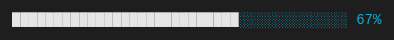

# @tuicomponents/progress

Renders horizontal progress bars for task completion

## Installation

```bash
pnpm add @tuicomponents/progress
```

## Quick Start

```typescript
import { createProgress } from "@tuicomponents/progress";
import { createRenderContext } from "@tuicomponents/core";

const component = createProgress();
const context = createRenderContext();

const result = component.render(
  {
    value: 67,
    max: 100,
    width: 40,
  },
  context
);
console.log(result.output);
```

## Examples

### basic

Simple progress bar



<details>
<summary>Input</summary>

```json
{
  "value": 67,
  "max": 100,
  "width": 40
}
```

</details>

### with-percentage

Progress bar with percentage


<details>
<summary>Input</summary>

```json
{
  "value": 42,
  "max": 100,
  "showPercentage": true,
  "width": 40
}
```

</details>

### labeled

Progress bar with label


<details>
<summary>Input</summary>

```json
{
  "value": 85,
  "max": 100,
  "label": "Download",
  "showPercentage": true,
  "width": 40
}
```

</details>

## Configuration Options

| Property         | Type      | Required | Default   | Description |
| ---------------- | --------- | -------- | --------- | ----------- | -------- | --- | --- | --- |
| `value`          | `number`  | ✓        | -         | -           |
| `max`            | `number`  |          | -         | -           |
| `width`          | `number`  |          | -         | -           |
| `style`          | `"block"  | "shaded" | "bracket" | "arrow"     | "ascii"` |     | -   | -   |
| `filledChar`     | `string`  |          | -         | -           |
| `emptyChar`      | `string`  |          | -         | -           |
| `label`          | `string`  |          | -         | -           |
| `showPercentage` | `boolean` |          | -         | -           |
| `showValue`      | `boolean` |          | -         | -           |

## Render Modes

The component supports two render modes:

- **ANSI**: Rich terminal output with colors and Unicode characters
- **Markdown**: Plain text suitable for AI assistants and documentation

You can specify the render mode when creating the context:

```typescript
import { createRenderContext } from "@tuicomponents/core";

// ANSI mode (default)
const ansiContext = createRenderContext({ renderMode: "ansi" });

// Markdown mode
const mdContext = createRenderContext({ renderMode: "markdown" });
```

## API

For detailed API documentation, see the [API docs](../../docs/progress.md).

## License

UNLICENSED
