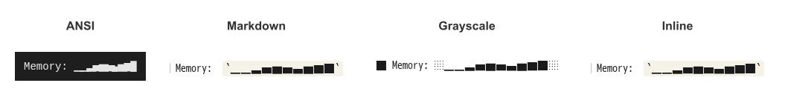
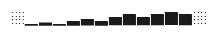

# @tuicomponents/sparkline

Compact inline sparkline visualization using height block characters (▁▂▃▄▅▆▇█)

## Installation

```bash
pnpm add @tuicomponents/sparkline
```

## Quick Start

```typescript
import { createSparkline } from "@tuicomponents/sparkline";
import { createRenderContext } from "@tuicomponents/core";

const component = createSparkline();
const context = createRenderContext();

const result = component.render(
  {
    values: [4, 2, 8, 5, 9, 3, 7, 6, 1, 8],
  },
  context
);
console.log(result.output);
```

## Examples

### basic

Simple sparkline with default settings


<details>
<summary>View individual modes</summary>

| ANSI                                                | Markdown                                                         | Grayscale                                                          | Inline                                                       |
| --------------------------------------------------- | ---------------------------------------------------------------- | ------------------------------------------------------------------ | ------------------------------------------------------------ |
|  |  |  |  |

</details>

<details>
<summary>Input</summary>

```json
{
  "values": [4, 2, 8, 5, 9, 3, 7, 6, 1, 8]
}
```

</details>

### cpu-usage

CPU usage monitoring over time


<details>
<summary>View individual modes</summary>

| ANSI                                                    | Markdown                                                             | Grayscale                                                              | Inline                                                           |
| ------------------------------------------------------- | -------------------------------------------------------------------- | ---------------------------------------------------------------------- | ---------------------------------------------------------------- |
|  |  |  |  |

</details>

<details>
<summary>Input</summary>

```json
{
  "values": [45, 52, 48, 65, 72, 58, 63, 71, 68, 55, 48, 52],
  "min": 0,
  "max": 100
}
```

</details>

### with-label

Sparkline with label prefix



<details>
<summary>View individual modes</summary>

| ANSI                                                     | Markdown                                                              | Grayscale                                                               | Inline                                                            |
| -------------------------------------------------------- | --------------------------------------------------------------------- | ----------------------------------------------------------------------- | ----------------------------------------------------------------- |
|  |  |  |  |

</details>

<details>
<summary>Input</summary>

```json
{
  "values": [2.1, 2.3, 2.8, 3.2, 3.5, 3.1, 2.9, 3.4, 3.8, 4.1],
  "label": "Memory: "
}
```

</details>

### stock-trend

Stock price trend


<details>
<summary>View individual modes</summary>

| ANSI                                                      | Markdown                                                               | Grayscale                                                                | Inline                                                             |
| --------------------------------------------------------- | ---------------------------------------------------------------------- | ------------------------------------------------------------------------ | ------------------------------------------------------------------ |
|  |  |  |  |

</details>

<details>
<summary>Input</summary>

```json
{
  "values": [142, 145, 143, 148, 152, 149, 155, 158, 154, 160, 163, 159]
}
```

</details>

## Configuration Options

| Property | Type       | Required | Default | Description |
| -------- | ---------- | -------- | ------- | ----------- |
| `values` | `number[]` | ✓        | -       | -           |
| `width`  | `number`   |          | -       | -           |
| `min`    | `number`   |          | -       | -           |
| `max`    | `number`   |          | -       | -           |
| `label`  | `string`   |          | -       | -           |
| `fit`    | `boolean`  |          | -       | -           |

## Render Modes

The component supports three render modes:

- **ANSI**: Rich terminal output with colors and Unicode characters
- **Markdown**: Plain text suitable for AI assistants and documentation
- **Grayscale**: ANSI output without colors (for terminals that don't support color)

You can specify the render mode when creating the context:

```typescript
import { createRenderContext } from "@tuicomponents/core";

// ANSI mode (default)
const ansiContext = createRenderContext({ renderMode: "ansi" });

// Markdown mode
const mdContext = createRenderContext({ renderMode: "markdown" });

// Grayscale mode
const grayscaleContext = createRenderContext({ renderMode: "grayscale" });
```

## API

For detailed API documentation, see the [API docs](../../docs/sparkline.md).

## License

UNLICENSED
