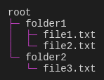

# @tuicomponents/tree

Renders hierarchical data as an ASCII/Unicode tree


## Installation

```bash
pnpm add @tuicomponents/tree
```

## Quick Start

```typescript
import { createTree } from "@tuicomponents/tree";
import { createRenderContext } from "@tuicomponents/core";

const component = createTree();
const context = createRenderContext();

const result = component.render(
  {
    root: {
      label: "root",
      children: [
        {
          label: "folder1",
          children: [
            {
              label: "file1.txt",
            },
            {
              label: "file2.txt",
            },
          ],
        },
        {
          label: "folder2",
          children: [
            {
              label: "file3.txt",
            },
          ],
        },
      ],
    },
  },
  context
);
console.log(result.output);
```

## Examples

### basic

Simple tree structure



<details>
<summary>Input</summary>

```json
{
  "root": {
    "label": "root",
    "children": [
      {
        "label": "folder1",
        "children": [
          {
            "label": "file1.txt"
          },
          {
            "label": "file2.txt"
          }
        ]
      },
      {
        "label": "folder2",
        "children": [
          {
            "label": "file3.txt"
          }
        ]
      }
    ]
  }
}
```

</details>

### project-structure

Project directory structure


<details>
<summary>Input</summary>

```json
{
  "root": {
    "label": "my-project",
    "children": [
      {
        "label": "src",
        "children": [
          {
            "label": "index.ts"
          },
          {
            "label": "utils.ts"
          },
          {
            "label": "types.ts"
          }
        ]
      },
      {
        "label": "tests",
        "children": [
          {
            "label": "index.test.ts"
          }
        ]
      },
      {
        "label": "package.json"
      },
      {
        "label": "tsconfig.json"
      },
      {
        "label": "README.md"
      }
    ]
  }
}
```

</details>

## Configuration Options

| Property   | Type      | Required  | Default    | Description |
| ---------- | --------- | --------- | ---------- | ----------- | --- | --- |
| `root`     | `object   | object[]` | ✓          | -           | -   |
| `style`    | `"ascii"  | "unicode" | "compact"` |             | -   | -   |
| `showRoot` | `boolean` |           | -          | -           |
| `indent`   | `number`  |           | -          | -           |

## Render Modes

The component supports two render modes:

- **ANSI**: Rich terminal output with colors and Unicode characters
- **Markdown**: Plain text suitable for AI assistants and documentation

You can specify the render mode when creating the context:

```typescript
import { createRenderContext } from "@tuicomponents/core";

// ANSI mode (default)
const ansiContext = createRenderContext({ renderMode: "ansi" });

// Markdown mode
const mdContext = createRenderContext({ renderMode: "markdown" });
```

## API

For detailed API documentation, see the [API docs](../../docs/tree.md).

## License

UNLICENSED
